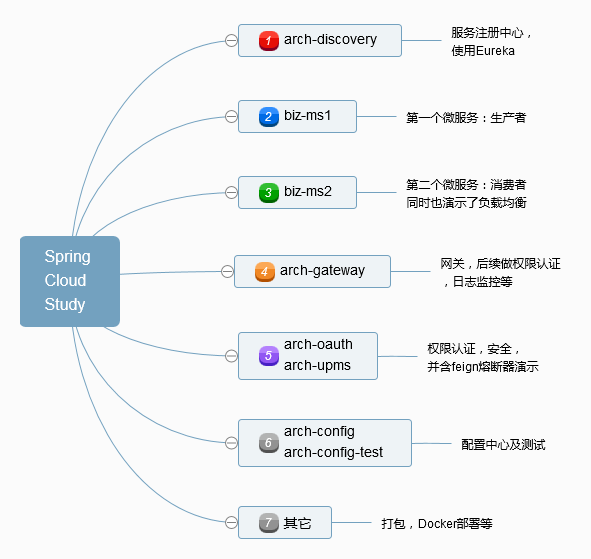

# spring-cloud-study

关于Spring Cloud的学习简明教程及实践，本教程与Spring官方等教程有所不同。因为本人没有系统地学习过Spring Boot及Spring Cloud，原因是简单：公司要求，而且非常紧急（只给四周的时间，含具体的业务微服务实现），所以代码偏多，教程文档偏少，要求读者具备一定的Spring Boot基础知识（或者足够聪明）。教程的顺序方面也是根据实际的业务，按过程实现的（但是在教程中，有部分教程前置了，比如网关，权限认证等，在实际实施过程中，是较后实现的）。

首先放上官方的Spring Cloud构架图

Spring网站上有Getting Started Guides，本人一开始也是从这开始的，但是不好意思，第一篇config就看得吃力。再陆续看了后面的几节，比如Broker这些，感觉与快速实现公司的任务不是那么重要，所以跳过了，取而代之的是本人自己的一条学习路线。

目录

- [arch-discovery](./arch-discovery/): 微服务注册与发现 
- [biz-ms1](./biz-ms1): 第一个具体的微服务
- [biz-ms2](./biz-ms2): 第二个具体的微服务

为啥要先从微服务注册开始呢？
因为微服务实施的关键在于服务治理，服务治理首先得需要一个注册中心吧，而几乎所有的微服务都需要向注册中心注册。

