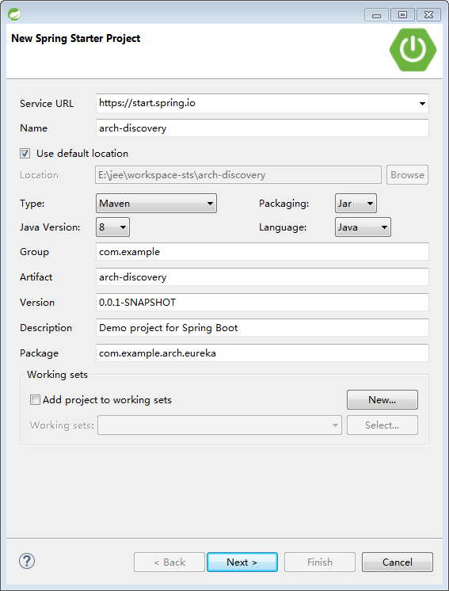

# 服务发现

## 新建工程arch-discovery

New Spring Starter Project arch-discovery



Project Dependencies 选择Web->Web, Cloud -> Eureka Discovery 和Eureka Server

Spring Boot Starter链接：https://start.spring.io/starter.zip?name=arch-discovery&groupId=com.example&artifactId=arch-discovery&version=0.0.1-SNAPSHOT&description=Demo+project+for+Spring+Boot&packageName=com.example.arch.eureka&type=maven-project&packaging=jar&javaVersion=1.8&language=java&bootVersion=2.0.1.RELEASE&dependencies=cloud-eureka-server&dependencies=cloud-eureka
由[spring.io]官方提供的快速搭建Spring Boot脚手架工具，将starter.zip解压后就是一个Spring Boot的项目了。

## 配置

### 配置文件
application.properties => application.yml

个人喜欢yml风格（亦是官方推荐的配置文件格式），所以，创建完工程后的第一件事就是将application.properties重命名为`application.yml`
配置如下：

```yml
spring:
  application:
    name: eureka-server
server:
  port: 8761
eureka:
  client:
    register-with-eureka: false #是否作为客户端从其它eureka server注册，未配置集群，设置为false
    fetch-registry: false #是否抓取注册的微服务，单独作为服务端，无需抓取，设置为false
```

PS: 在sts(Spring Boot Suite)中，格式化yml会丢失注释，请小心使用Ctrl + Shift + F格式化配置文件

### 代码

打开`ArchDiscoveryApplication.java`在类上添加`@EnableEurekaServer`注解，设置其为服务发现服务端，一个服务发现的服务端就好了！too easy~

```java
@EnableEurekaServer
@SpringBootApplication
public class ArchDiscoveryApplication {
    public static void main(String[] args) {
        SpringApplication.run(ArchDiscoveryApplication.class, args);
    }
}
```

### 运行

右击ArchDiscoveryApplication.java，Run as Java Application或 Run as Spring Boot App，都可以运行

打开浏览器，输入http://localhost:8761 验证是否运行/配置成功，如果成功打开网页，说明服务发现服务端OK了

## Eureka控制台

输入http://localhost:8761访问Eureka控制台，可以查看Eureka Server相关的信息，包含System Status, DS Replicas, Instances, General Info等信息，其中有两项比较重要。

### Instances currently registered with Eureka

| Application   |     AMIs     |   Availability Zones |       Status                |
| ------------- | ------------ | -------------------  | --------------------------- |
| BIZ-MS1       | n/a (1)      | (1)                  |UP (1) - 192.168.133.15:8080 |

这个表格列出了所有注册到Eureka Server的Eureka Client列表，`Status`列中的 `UP`表示正常，如果为红色的`DWON`表示微服务已下线，Eureka Client中的`eureka.instance`配置会影响到`Status`列的显示，比如biz-ms1在bootstrap.yml中配置了`eureka.instance.instance-id: ${spring.cloud.client.ipaddress}:${server.port}`，则Appication的`Status`列显示的是ip:port格式（默认是主机名称+端口号）

### General Info

| Name                 |     Value                      |
| -------------------- | -----------------------------  |
| registered-replicas  | http://localhost:8761/eureka/  |
| unavailable-replicas | http://localhost:8761/eureka/, |
| available-replicas   |                                |

这个表格主要是Eureka Server的基本信息，其中`registered-replicas`，`unavailable-replicas`, `available-replicas`表示的Eureka Server也作为Client端向其中Eureka Server注册的信息（实现高可用的Eureka集群），如果注册的地址将在`available-replicas`中，表示集群工作正常。

## 测试

Spring Boot Starter工程会自动生成一个`xxApplication.java`和`xxApplicationTests.java`后续将尽量不使用浏览器测试验证，而以测试用例的方式来验证。
打开`ArchDiscoveryApplicationTests.java`，编辑测试代码并执行JUnit测试，看是否执行成功。

```java
@RunWith(SpringRunner.class)
@SpringBootTest(webEnvironment = WebEnvironment.MOCK)
@AutoConfigureMockMvc
public class ArchDiscoveryApplicationTests {

    @Autowired
    MockMvc mvc;

    @Test
    public void contextLoads() throws Exception {
        // @formatter:off
        mvc.perform(MockMvcRequestBuilders.get("/")
            .accept(MediaType.TEXT_HTML))
            .andExpect(status().isOk());
        // @formatter:on
    }
}
```

## 进阶

### Eureka配置 

先放一个配置文件

```yml
eureka:
  client:
    service-url:
      defaultZone: http://another.eureka.server.host:port/eureka/
    register-with-eureka: true
  instance:
    ip-address: host ip address # if set `prefer-ip-address`, the assigned ip will replace the defaut ip
    prefer-ip-address: true # use ip address (get from network automatically) register to server
    hostname: ${spring.cloud.client.ipaddress}
  server:
    enable-self-preservation: false # close self preservation to drop shutdown micro-service from registry
    eviction-interval-timer-in-ms: 30000
```

大致常用的讲解一下，其实的自己看官方文档

client 

客户端相关

- service-url: 配置eureka 服务端的地址，使用zone: url的方式配置
 url可以使用英文`,`分隔，如http://ip1:port1/eureka/,http://ip2:port2/eureka/ 但是注意了，英文`，`前后不能带空格，`/eureka/`是固定的，不能少
 spring boot 2.0，几乎所有的配置项名称都变成小写了，使用-连接单词，但是这个defaultZone，一定要是defaultZone，除非你更改availability-zones的配置（biz-ms1中有示例）
- register-with-eureka：默认为true，表示会连接eureka服务端注册，和上面的service-url联合使用

instance

跟你eureka服务端上注册到eureka的Application列表项中的Status有关

- prefer-ip-address: 向eureka服务端使用IP注册，如果设置为true，将使用一定的算法（根据网卡配置）获取网络IP，如果是eureka服务端，需要设置为true
- ip-address：手动指定一个ip，将覆盖prefer-ip-address为true时自动获取的IP
- hostname: 主机名称，如不指定，将默认为eureka计算生成的名称，如在docker环境中则container id
- status-page-url-path: 默认的状态页路径，如使用swagger2，则可以写成/swagger-ui.html，点击status链接到api文档

server

当作为Server端时的配置

[spring.io]: https://spring.io/
[ignore-network-interfaces]: http://cloud.spring.io/spring-cloud-static/Camden.SR3/#ignore-network-interfaces
